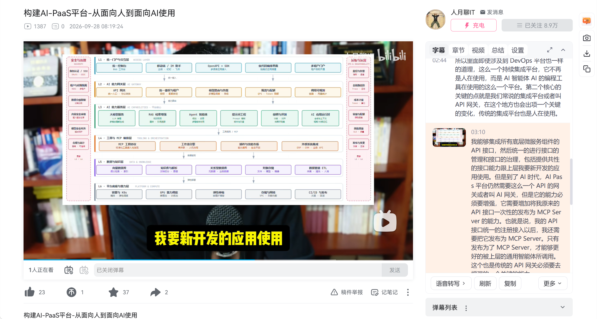
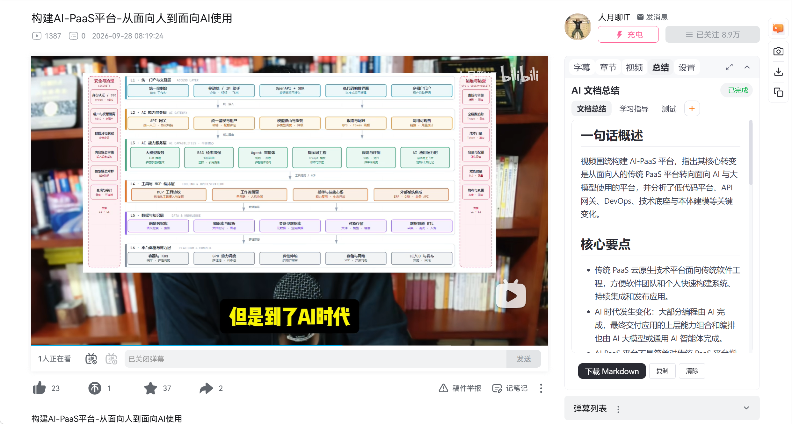

# BiliAiNote｜B站视频字幕笔记

在 B 站视频页抓取字幕、截取视频帧画面，生成带有截图的 Markdown 笔记。支持接入任意 OpenAI 兼容大模型（LLM）流式总结文档，配合本地 BilibiliDownloader 客户端可下载视频、对无字幕视频语音转写。

## 功能

- 📝 **字幕抓取** — 自动获取 B 站视频字幕，支持多语言切换（含 AI 生成字幕）
- 🎙️ **语音转写** — 视频无字幕时，经本地客户端提取音频并流式转写为字幕，结果持久化可恢复
- 📷 **视频截图** — 为字幕/章节添加视频帧截图，支持上一帧/下一帧微调
- ✂️ **截图裁剪** — 基于 Cropper.js 的图片裁剪、缩放、旋转、翻转
- 📋 **章节支持** — 展示视频章节，按章节分段导出
- ⬇️ **视频下载** — 委托本地 BilibiliDownloader 客户端下载视频（无字幕时同时生成 MP3 供转写），完成后显示文件链接，一键打开所在文件夹
- 🤖 **AI 总结** — 接入 OpenAI 兼容 LLM 接口（DeepSeek / Ollama / LM Studio 等均可），多配置管理、测试连接、同一时间启用一个；流式输出，完成后按 Markdown 渲染
- 💬 **多提示词** — 内置「文档总结」「学习指导」两种提示词，支持新增自定义提示词，每个提示词独立任务、独立结果
- 💾 **整理缓存** — 总结结果按视频 × 提示词缓存，无需重复整理，Options 页可查看历史
- � **多格式导出** — SRT 字幕、Markdown 笔记（含截图时打包 ZIP，截图打包可按提示词开关）
- �🔄 **自动刷新** — 视频切换时自动获取新字幕
- 🎯 **字幕同步** — 播放时高亮当前字幕，自动滚动跟随，点击字幕跳转播放
- 🧰 **悬浮功能条** — 可拖动悬浮图标，快捷添加截图到字幕 / 下载截图 / 复制截图到剪贴板
- 🖼️ **图标状态** — 视频页图标正常显示，非视频页图标变暗
- ⚙️ **面板管理** — 支持放大（半屏全高）、折叠、拖动，记忆上次展开方式

## 功能演示



<br>



## 使用教程


## 安装方式

### Chrome / Edge

1. 在 GitHub 的 [Releases](https://github.com/astonish921/BiliAiNote/releases) 页面下载最新的 `biliainote-v*-chrome.zip` 包
2. 解压到任意本地目录
3. 打开扩展管理页：
   - Chrome：`chrome://extensions/`
   - Edge：`edge://extensions/`
4. 开启"开发者模式"
5. 点击"加载已解压的扩展程序"
6. 选择解压后的扩展目录（包含 `manifest.json` 的目录）

### 从源码安装

```bash
git clone https://github.com/astonish921/BiliAiNote.git
```

然后按照上述步骤 3-6 加载扩展。

## 使用方法

1. 打开 B 站视频页（支持 `/video/BV*` 和 `/list/*` 页面）
2. 点击浏览器工具栏上的 BiliAiNote 图标打开面板（图标正常表示可用）
3. 面板自动获取当前视频字幕
4. 为需要的字幕/章节添加截图
5. 在「总结」页用 LLM 生成文档，或在底部「更多」菜单导出笔记

### 面板功能

| 标签页 | 功能                                                                                                       |
| ------ | ---------------------------------------------------------------------------------------------------------- |
| 字幕   | 字幕列表、语言切换（含 AI 字幕）、语音转写、添加截图、复制、跳转、高亮同步                                 |
| 章节   | 章节列表、添加截图、复制、跳转                                                                             |
| 视频   | 视频下载（客户端）、文件定位、勾选写入笔记的视频属性（标题/作者/日期/时长/地址/简介/时间戳），逐项一键复制 |
| 总结   | LLM 流式总结，多提示词切换，下载 Markdown（可打包截图 ZIP）/复制/清除，结果自动缓存                        |
| 设置   | 三大分区：基础信息（帧步长/自动滚动等开关）、LLM 接口、客户端地址                                          |

### LLM 接口配置

1. 进入「设置 → LLM 接口」，点击「＋ 添加 LLM」
2. 填写配置名称、API 地址（需包含 `/v1`，如 `http://127.0.0.1:8071/v1`）、API Key、模型ID
3. 点击「测试连接」验证可用后保存，启用该配置（同一时间仅一个生效）
4. 支持多个配置随时切换，兼容所有 OpenAI 风格接口：DeepSeek 官方 API、Ollama、LM Studio、各类中转服务等

### AI 总结

点击「总结」标签页：

1. 选择提示词（内置「文档总结」「学习指导」，或自定义提示词，「＋」按钮跳转管理页）
2. 点击「开始整理」，LLM 流式输出，完成后渲染为 Markdown
3. 生成中可「停止整理」；完成后可下载 Markdown（按提示词配置可打包截图 ZIP）、复制、清除
4. 结果按视频 × 提示词自动缓存，重开页面或切换标签后可恢复，同一视频无需重复整理

### 本地客户端（BilibiliDownloader）

视频下载与语音转写依赖本地客户端，在「设置 → 客户端地址」配置访问地址（默认 `http://127.0.0.1:17563`）：

- **视频下载**：「视频」页点击下载，客户端抓取视频；无字幕视频会同时生成 MP3
- **语音转写**：视频无 B 站字幕时，「字幕」页出现「语音转写」按钮，客户端提取音频并流式转写，转写结果持久化（刷新页面自动恢复，可清空）
- 客户端未启动时页面会给出提示与下载链接

### 底部按钮

| 按钮     | 功能                                                  |
| -------- | ----------------------------------------------------- |
| 语言切换 | 切换字幕语言（含 AI 字幕 / 语音转写）                 |
| 刷新     | 重新获取当前视频字幕                                  |
| 复制     | 复制全部字幕文本到剪贴板                              |
| 更多     | 导出 SRT、下载 MD（含截图打包 ZIP）、清空语音转写字幕 |

### 截图功能

- 点击字幕/章节行的「截图」按钮，自动跳转到对应时间点并截取当前帧
- 点击缩略图打开截图浏览界面
- 浏览界面支持：拖动图片、上一帧/下一帧、下载、复制到剪贴板
- 点击「裁剪」进入裁剪模式：支持裁剪框调整、缩放、旋转、翻转
- 点击「取消截图」可移除已添加的截图
- 视频右侧悬浮功能条：添加截图到字幕、下载截图、复制截图到剪贴板

### 导出格式

**纯 Markdown**（无截图时直接下载 .md 文件）

```markdown
---
title: "视频标题"
author: "作者名"
---

# 视频标题

## 章节

- 章节一
- 章节二

## 字幕

### 章节一

字幕文本
```

**含截图**（有截图时打包为 .zip）

```
note.zip
├── note.md
└── assets/
    ├── 0009.png
    ├── chapter-1.png
    └── ...
```

> 章节/字幕时间戳可在「视频」页勾选控制，默认不带时间戳。

## 项目结构

```
BiliAiNote/
├── manifest.json      # 扩展配置 (Manifest V3)
├── background.js      # Service Worker - B站 API 代理、LLM 流式转发、客户端通信、下载/转写管理
├── content.js         # 入口脚本 - 面板注入、路由监听、视频切换检测
├── options.html       # 选项页面 - 提示词管理、文档整理历史
├── js/
│   ├── state.js       # 全局状态管理
│   ├── panel.js       # 面板 UI - 标签页、总结页、设置页、折叠/放大/拖动
│   ├── subtitle.js    # 字幕 - 获取、多语言、语音转写、渲染、高亮同步、跳转
│   ├── chapter.js     # 章节 - 获取、渲染、跳转
│   ├── video-info.js  # 视频信息 - 笔记属性勾选、逐项复制
│   ├── video-download.js # 视频下载 - 客户端委托、进度、文件定位、下载记录
│   ├── capture.js     # 截图 - OffscreenCanvas、保存、剪贴板
│   ├── crop-viewer.js # 截图浏览 - Cropper.js 裁剪、缩放、旋转、翻转
│   ├── export.js      # 导出 - SRT、Markdown、ZIP
│   ├── llm-doc.js     # LLM 文档总结 - 任务工厂、流式 chunk、状态机
│   ├── ai-summary.js  # AI 场景总结模块
│   ├── options.js     # Options 页面 - 提示词管理、文档整理历史
│   ├── cache.js       # 总结缓存 - chrome.storage.local 持久化
│   └── settings.js    # 设置 - 多 LLM 配置、默认值、迁移
├── css/
│   └── panel.css      # 面板样式
├── libs/
│   ├── jszip.min.js       # ZIP 打包库
│   ├── cropper.min.js     # Cropper.js 裁剪库
│   ├── cropper.min.css
│   └── markdown-it.min.js # Markdown 渲染库
└── icons/             # 扩展图标（正常 + 变暗状态）
```

## 技术要点

- **Manifest V3** Chrome 扩展
- **双源 API 策略**：优先 `player/wbi/v2`（aid），回退 `player/v2`（bvid）
- **字幕轨道排序**：按语言优先级稳定排序（中文 > 英文 > 其他），AI 字幕带标记
- **LLM 接口直连**：OpenAI 兼容 `/chat/completions` 流式转发，经 background 代理规避 CORS，多配置单启用
- **本地客户端协议**：BilibiliDownloader 健康检查、下载进度流、语音转写流、文件定位（reveal）
- **SPA 路由监听**：MutationObserver 检测 URL 变化，自动刷新
- **图标状态**：根据页面类型动态切换正常/变暗图标
- **事件委托**：单次绑定避免监听器泄漏
- **请求取消**：fetchRunId 机制防止过期请求污染状态
- **截图裁剪**：基于 Cropper.js，支持裁剪、缩放、旋转、翻转
- **Markdown 渲染**：markdown-it 渲染总结结果（禁用原始 HTML 保证安全，外链新标签打开）
- **自动滚动控制**：用户上滑暂停自动滚动，回到底部恢复；滚动落点限制在视口内
- **总结缓存**：按视频/页码/提示词缓存，Options 页查看历史
- **面板存活保护**：setInterval 监控 + Vue 组件树恢复，应对 B站 #app 替换

## 兼容性

- Chrome 88+ (Manifest V3)
- Edge 88+ (Manifest V3)

## 许可证

[MIT](LICENSE)

## 致谢

- 基于hyglgithub的 BiViNote 项目改造：https://github.com/hyglgithub/BiViNote

## 免责声明

> ▎ **用户自负责任条款**：本工具仅在用户已登录 B 站、且有访问权限的前提下获取数据。所有数据通过用户自己的浏览器获取，不经过任何第三方服务器。本工具不存储、不分发任何 B 站内容。使用本工具产生的所有后果由用户自行承担。请遵守 B 站用户协议与相关法律法规。
